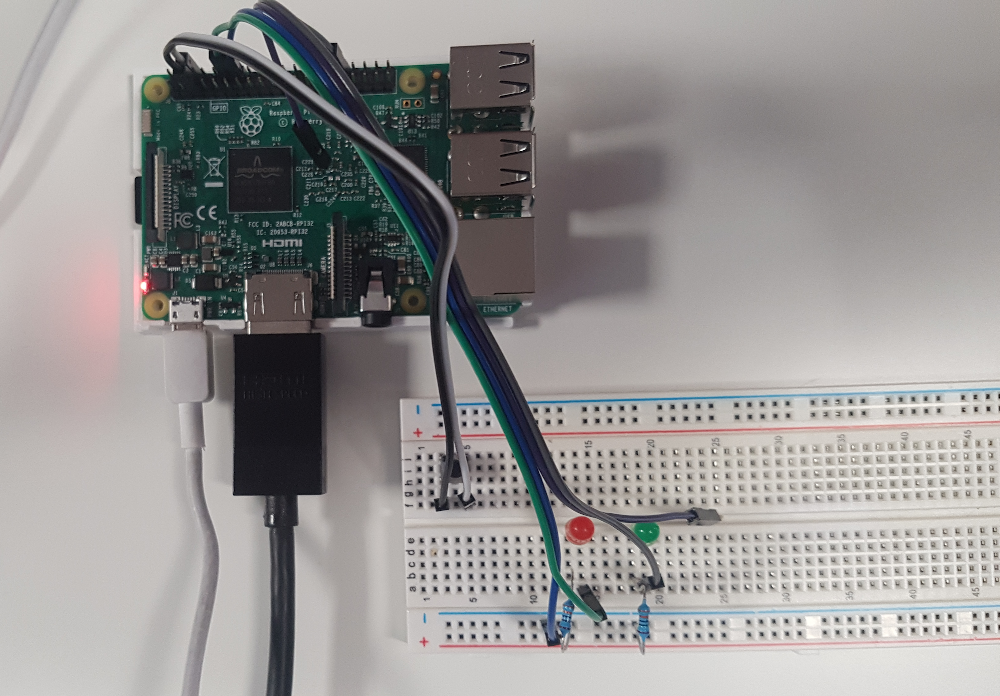
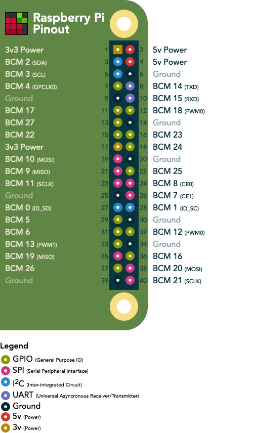

<h1 align="center">Welcome to Coffee Button 👋</h1>

  

> Order your coffee in one click or everything else  
> Click the button, the raspberry boot, call your webhook then shutdown

## Prototype

## Install

### What you need to run the project

 - a Raspberry Pi with Wifi, or ethernet connection if you like cables
 - an SD card (2GB should do)
 - 2 leds (red & green, or anything you see fit) with 330Ω resitors and cables
 - a push button with cables
 - optionnaly a breadboard, to check the connections before soldering the elements

### How to build

 * Connect the push button on pins 5 & 6 _(SCL & Ground)_, so the click will wake it.
 * Connect the green led and a resistor on pins 32 & 34 _(PWM0 & Ground)_.
 * Connect the red led and the other resistor on pins 12 & 14 _(PWM0 & Ground)_.

### How to setup

 * Get a Raspbian lite image from the [official page](https://www.raspberrypi.org/downloads/raspbian/)
 * Burn it on the SD card: ex. on Linux/BSD -> `sudo dd bs=1M conv=noerror,sync status=progress if=<path_to_your_img/name.img> of=<path_to_mounted_SDcard>`
 * Start the pi with screen and keyboard to configure Wifi, using the `sudo raspi-config` command
 * Install git on the pi and clone the repositorty or copy source code to `/home/pi/coffee-button` on the pi
 * Make a copy of `.env.example` to `.env` and add the webhook and token you created. We used Zapier to handle the request and filter the Authorization header then send the email and Slack notification.
 * Test the script on pi by running `home/pi/coffee-button/init.sh`
 * Add a line to call the `init.sh` file from your boot `/etc/rc.local` 
 
 **Warning** :warning: _Doing this last action will prevent you to access the pi via keyboard or SSH and force you to mount the SD card on your computer again!. Be sure that everything is in order before that or comment the last line of the `init.sh` script_

## Usage

Push the button !
Leds will flashes after a few seconds then green if the request was sent or was in the previous 48h, red if something went wrong.

## Author

👤 **Jérémy Lejeune**

* Github: [@yodur2potassium](https://github.com/yodur2potassium)

👤 **Lucas Dupuy**

* Github: [@louckousse](https://github.com/louckousse)

## Show your support

Give a ⭐️ if this project helped you!

## 📝 License

Copyright © 2019 [Jérémy Lejeune](https://github.com/yodur2potassium), [Lucas Dupuy](https://github.com/louckousse). 
This project is [GPL 3](https://www.gnu.org/licenses/gpl-3.0.html) licensed.

***
_This README was generated with ❤️ by [readme-md-generator](https://github.com/kefranabg/readme-md-generator)_

