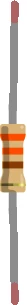

<h1 align="center">Welcome to Coffee Button 👋</h1>

  

> Order your coffee in one click or everything else  
> Click the button, the raspberry boot, call your webhook then shutdown

## Prototype

## Install

### What you need to run the project

 - a Raspberry Pi with Wifi, or ethernet connection if you like cables
 - an SD card
 - 2 leds with 330Ω resitors and cables
 - a push button with cables
 - optionnaly a breadboard, to check the connections before soldering the elements

### How to build

 * Connect the push button on pins 5 & 6 _(SCL & Ground)_, so the click will wake it.
 * Connect the green led and a resitor on pins 32 & 34 _(PWM0 & Ground)_.
 * Connect the red led and the other resistor on pins 12 & 14 -(PWM0 & Ground)_.

### How to setup

 * Get a Raspbian lite image from the [official page](https://www.raspberrypi.org/downloads/raspbian/)
 * Burn it on the SD card: 
 ..* on Linux/BSD -> `sudo dd bs=1M conv=noerror,sync status=progress if=<path_to_your_img/name.img> of=<path_to_mounted_SDcard>`
 * Start the pi with screen and keybaord to configure Wifi, using the `sudo raspi-config` command
 * Copy source code to `/home/pi/coffee-button` on the pi
 * Copy `.env.example` to `.env` and add the webhook and token you created
 * Add a line to call the `init.sh` file from your boot `/etc/rc.local` on raspbian lite

## Usage

Push the button !
Leds will flashes after a few seconds then green if the request was sent or was in the previous 48h, red if something went wrong.

## Author

👤 **Jérémy Lejeune**

* Github: [@yodur2potassium](https://github.com/yodur2potassium)

👤 **Lucas Dupuy**

* Github: [@louckousse](https://github.com/louckousse)

## Show your support

Give a ⭐️ if this project helped you!

## 📝 License

Copyright © 2019 [Jérémy Lejeune](https://github.com/yodur2potassium), [Lucas Dupuy](https://github.com/louckousse). 
This project is [GPL 3](https://www.gnu.org/licenses/gpl-3.0.html) licensed.

***
_This README was generated with ❤️ by [readme-md-generator](https://github.com/kefranabg/readme-md-generator)_

